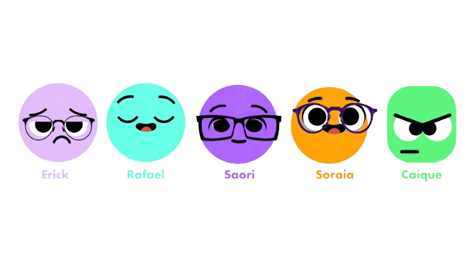

<h1 align="center">Olá, somos a Lumino! 🌟</h1>

###

<h2 align="left">Lumino</h2>

###

🌟 Bem-vindo ao repositório oficial da Lumino! 🌟  Somos uma empresa de desenvolvimento de software 💻 formada por cinco fundadores dedicados a criar soluções inovadoras e eficientes 🌟 para atender às necessidades de nossos clientes. Este repositório contém o código-fonte 📂 e a documentação 📄 dos nossos projetos.✨

###

<h2 align="left">Sobre nós ✨</h2>

###

✨ A Lumino foi fundada por um grupo de cinco estudantes apaixonados por tecnologia 💡 e desenvolvimento de software 💻. Nossa missão é desenvolver produtos que não apenas atendam às necessidades do mercado, mas que também sejam intuitivos, personalizados e fáceis de usar 🌟. Este projeto faz parte do nosso Trabalho de Conclusão de Curso (TCC) 🎓 e representa o culminar de nossos estudos 📚 e esforços ao longo desse ano.

###

  
  
  
  
  
  
  
  
  
  
  
  
  

###

   
  <h2>Fundadores</h2>
  

  Direitos Autorais
© 2024 Lumino. Todos os direitos reservados.

